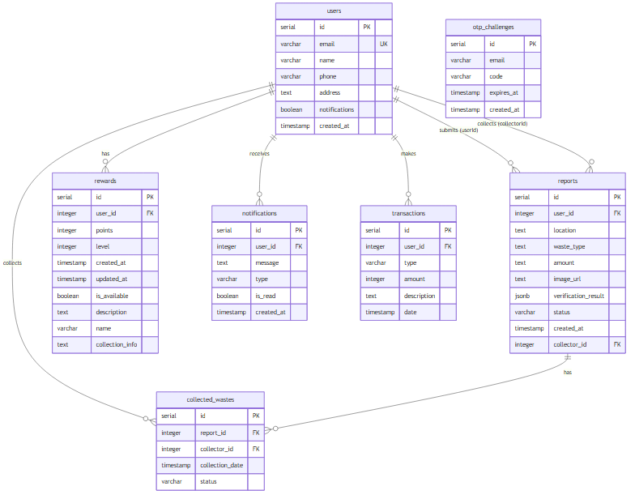

# EcoRise: Zero to Hero - Waste Management Application

## 🌟 Key Idea
EcoRise is an innovative, AI and Web3-enabled waste management platform that incentivizes users to report and collect waste. By gamifying waste management, we turn an everyday chore into a rewarding experience, transforming communities from "Zero to Hero".

## 🎯 Aim
To create a sustainable, clean environment by empowering individuals with technology. We aim to bridge the gap between waste generators and waste collectors through a decentralized, transparent, and rewarding ecosystem.

## ✨ Features
- **AI-Powered Waste Verification:** Uses Google Gemini AI to analyze user-uploaded images of waste, verifying the type and amount automatically.
- **Interactive Maps:** Real-time location tracking for waste reports using Leaflet and Google Maps API.
- **Reward System:** Users earn coins for reporting and collecting waste, gamifying the environmental cleanup process.
- **Smart Contracts & Web3 Integration:** Utilizes Ethereum, Hardhat, and Chainlink for secure, transparent transaction tracking.
- **Responsive UI/UX:** A beautiful, responsive interface built with Next.js, Tailwind CSS, and Lucide icons, featuring dark/light modes.

## 🚀 Future Enhancements
- **Real Money Integration:** The coins earned in the platform will be integrated with real-world currency.
- **UPI Withdrawals:** Users will be able to directly transfer their earned rewards to their bank accounts via UPI IDs.
- **Advanced IoT Integration:** Smart bins that automatically report when they are full.
- **Community Leaderboards & NFTs:** Rewarding top contributors with exclusive Web3 assets and community recognition.

## 🛠 Tech Stack
- **Frontend:** Next.js 14, React 18, Tailwind CSS, Lucide React
- **Backend:** Next.js Server Actions, Node.js
- **Database:** PostgreSQL (Neon Serverless), Drizzle ORM
- **AI:** Google Generative AI (Gemini)
- **Web3 / Blockchain:** Solidity, Hardhat, Ethers.js, Viem, Chainlink, LayerZero, Lit Protocol, EthSign
- **Mapping:** React Leaflet, React Google Maps API

## 🗄️ Database Design

*The database consists of the following core tables:*
- **Users:** Stores user profiles, contact info, and preferences.
- **Reports:** Stores waste reports with location, type, amount, image URL, AI verification results, and status.
- **Rewards:** Manages user reward points, levels, and available rewards.
- **CollectedWastes:** Tracks the lifecycle of waste from report to successful collection.
- **Notifications:** Manages user alerts and updates.
- **Transactions:** Logs all earning and redeeming activities of users.
- **OtpChallenges:** Handles secure authentication via OTPs.

## 🏛 Architecture

The architecture follows a modern serverless Web3 approach:
1. **Client Layer:** Next.js frontend deployed on Vercel, providing a fast, reactive UI.
2. **API Layer:** Next.js API routes act as the backend, handling business logic, AI verification, and Web3 interactions.
3. **Data Layer:** PostgreSQL hosted on Neon, accessed via Drizzle ORM for type-safe database queries.
4. **AI Layer:** Google Gemini processes images uploaded to cloud storage to verify waste authenticity.
5. **Blockchain Layer:** Smart contracts deployed via Hardhat handle decentralized logic and trustless operations.
